#  AI-Powered API 

## About the Project

This application completely automates the job application routine, reducing preparation time by 90%. The entire analysis and generation workflow takes only 5–10 minutes, allowing you to significantly increase the volume of your job applications without sacrificing quality.

**Key Features:**
*   **Match Analysis:** Evaluates the job description against your skills and experience to calculate a precise match percentage.

*   **Instant Company Research:** Extracts core company information immediately, eliminating the need for time-consuming manual searches and reading.

*   **Cover Letter Generation:** Automatically writes a personalized cover letter tailored specifically to the target position.

*   **PDF CV Creation:** Generates a customized resume in PDF format, highlighting the most relevant experience.

*   **Google Sheets Integration:** Automatically logs application details and tracking records directly into a spreadsheet to save time.

A professional backend application built with **NestJS**, designed for rapid deployment and scalability. The project integrates advanced AI capabilities using **LangChain**, **langgraph** supports **OpenAI** and **Google GenAI** models, and includes tools for PDF document analysis and intelligent web search. 

---


###  System Workflow Diagram

```text
User Actions:
1. Provide Resume (Text or PDF)
2. Input Job Description & Company Name or company Url
3. Run Full AI Analysis & Generation
       │
       ▼
┌─────────────────────────────────────────────────────────────────────────┐
│                          NESTJS API ROUTER                              │
└─────────────────────────────────────────────────────────────────────────┘
       │
       ├───────────────────┬───────────────────┬───────────────────┐
       ▼                   ▼                   ▼                   ▼
┌───────────────┐   ┌───────────────┐   ┌───────────────┐   ┌───────────────┐
│  MATCH GRAPH  │   │COMPANY RESEARCH│  │ COVER LETTER  │   │ TAILORED CV   │
│  (LangGraph)  │   │ (Tavily API)  │   │  (LangGraph)  │   │  (LangGraph)  │
└───────────────┘   └───────────────┘   └───────────────┘   └───────────────┘
       │                   │                   │                   │
       ├─ Score (0-100%)   ├─ Industry & Size  ├─ Custom Letter    ├─ Optimized Bullets
       └─ Skill Gap        └─ Red Flags        └─ Job Keywords     └─ Tailored PDF CV
       │                   │                   │                   │
       └───────────────────┴─────────┬─────────┴───────────────────┘
                                     │
                                     ▼
                      ┌──────────────────────────────┐
                      │    LLM WITH TIMEOUT &        │
                      │       FALLBACK ENGINE        │
                      │  Primary: Gemini 1.5 Flash   │
                      │  Fallback: Mistral 12B       │
                      └──────────────────────────────┘
                                     │
                                     ▼
                      ┌──────────────────────────────┐
                      │    GOOGLE SHEETS TRACKER     │
                      │ (Auto-logs Job & Result Data)│
                      └──────────────────────────────┘

```                      

## *screenshots*


<div style="display: flex; flex-wrap: wrap; gap: 15px;">

  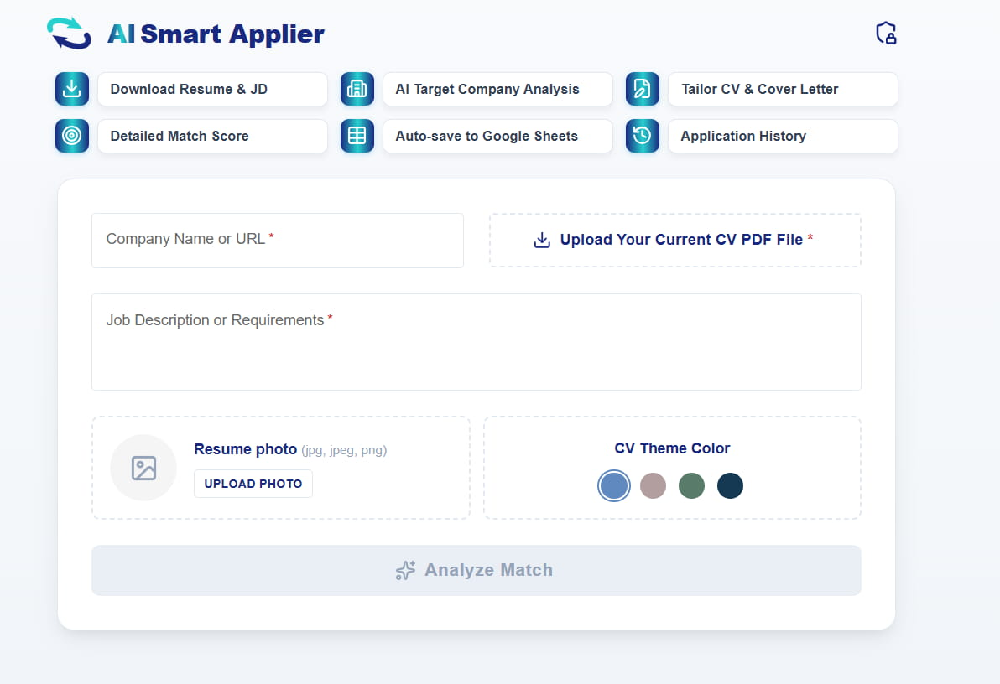
  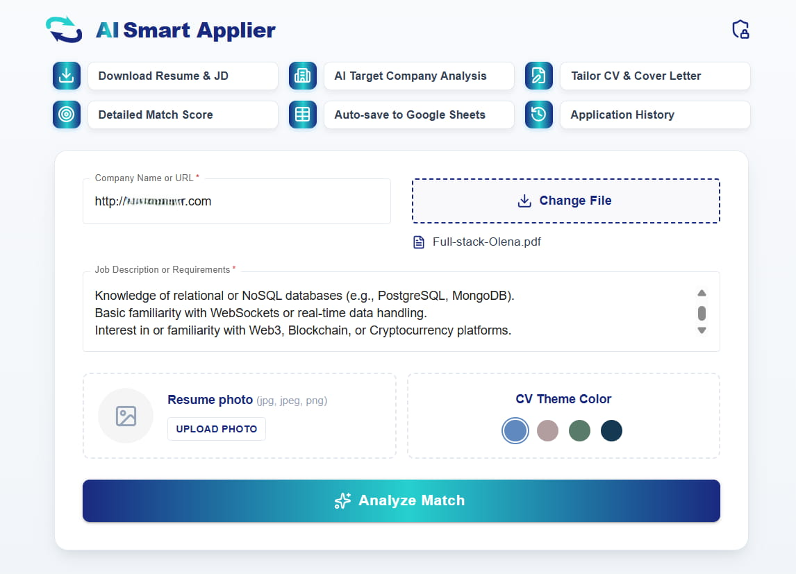
  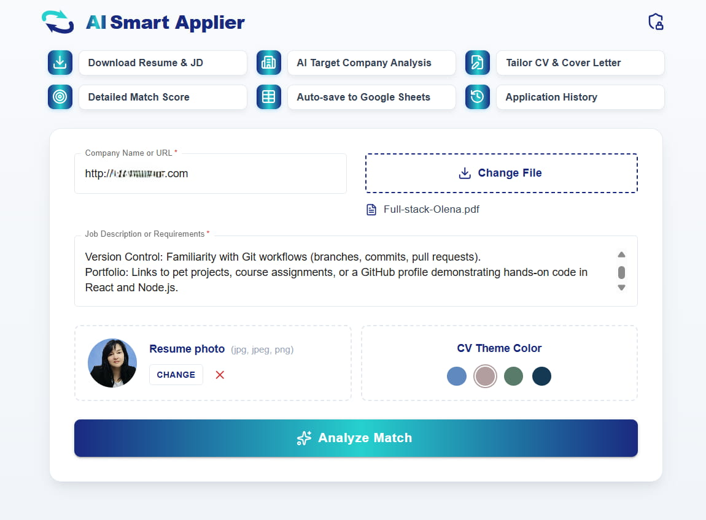
  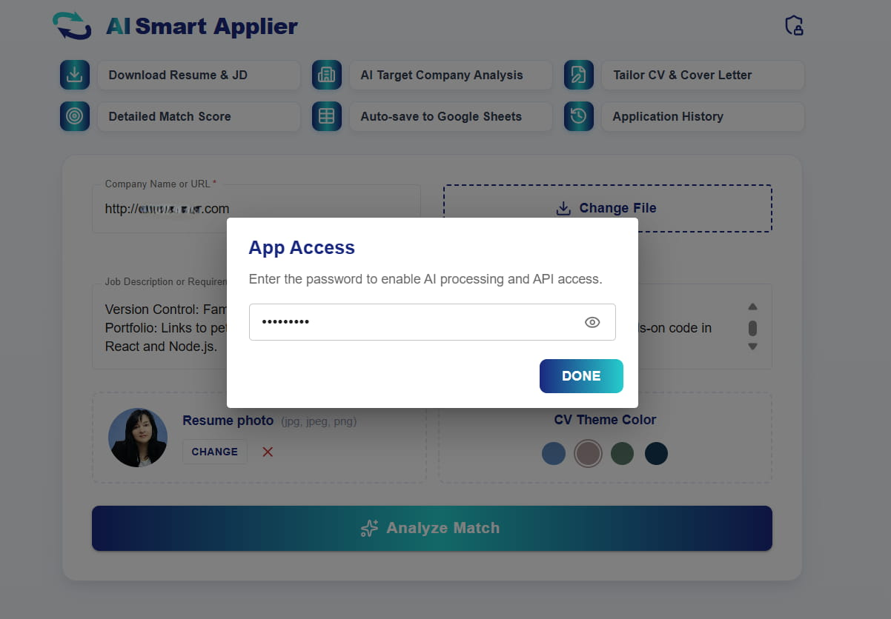
  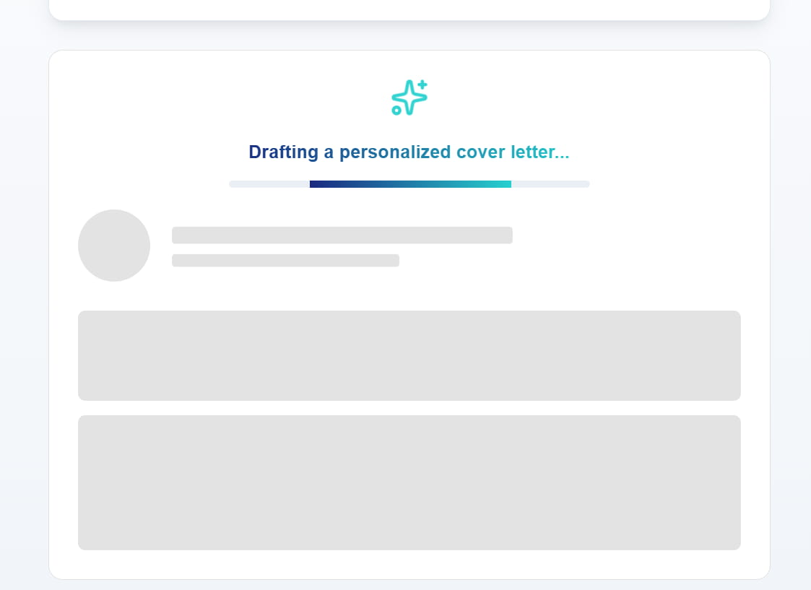
  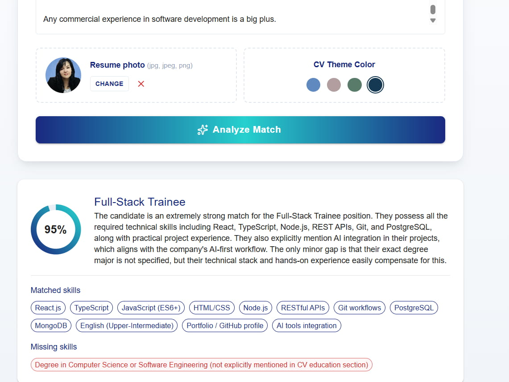
  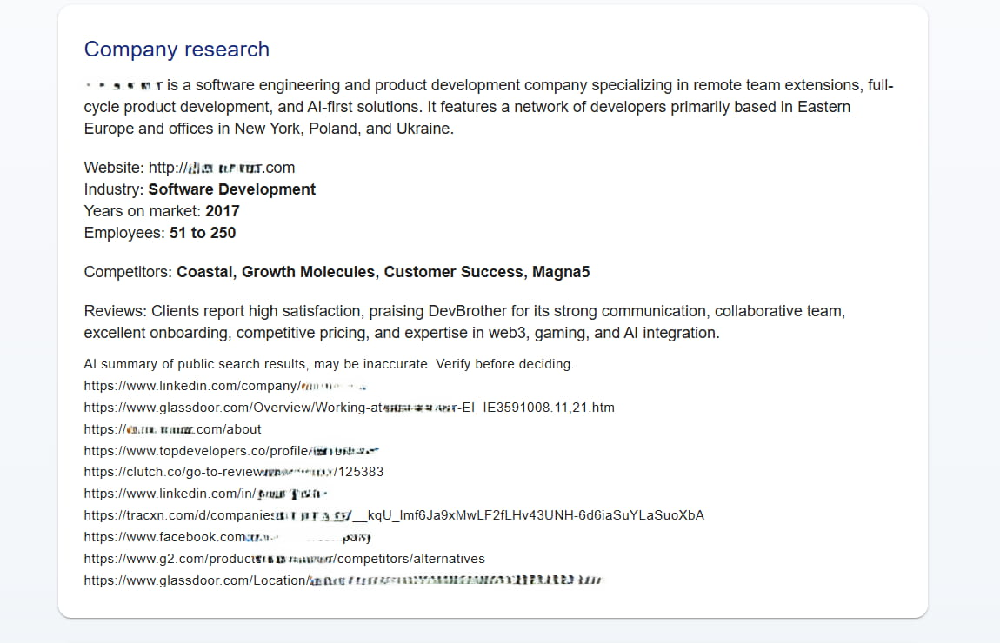
  
  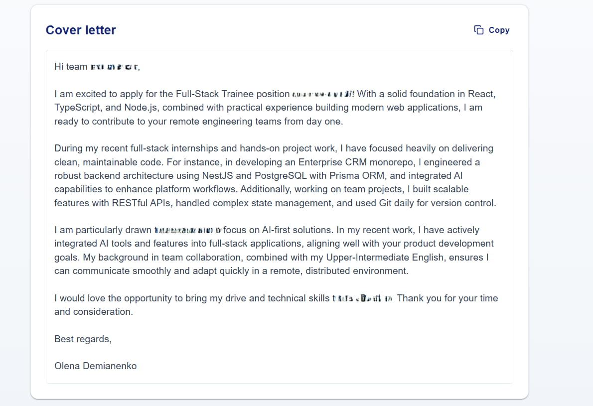
  
  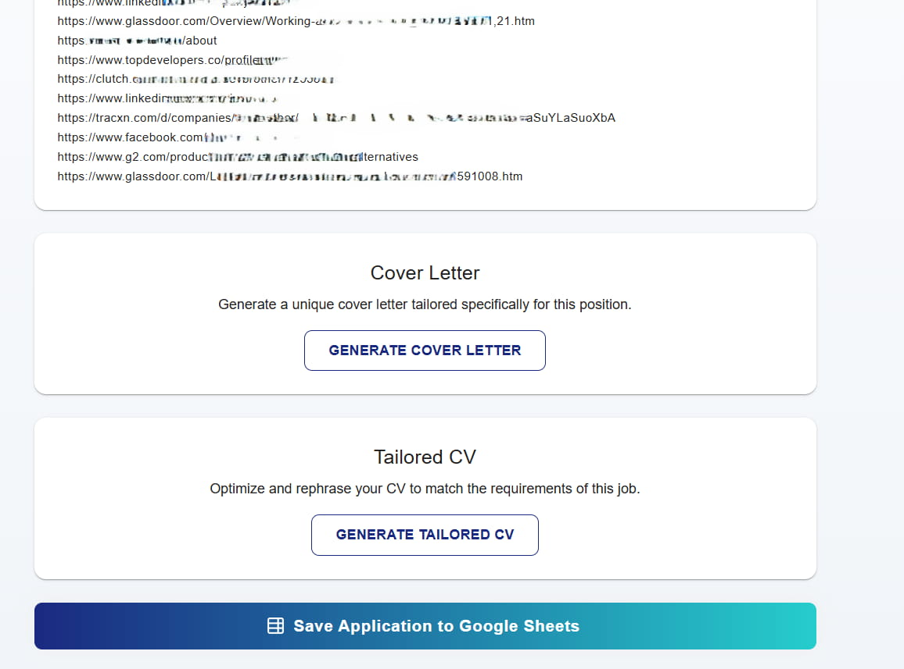
   
  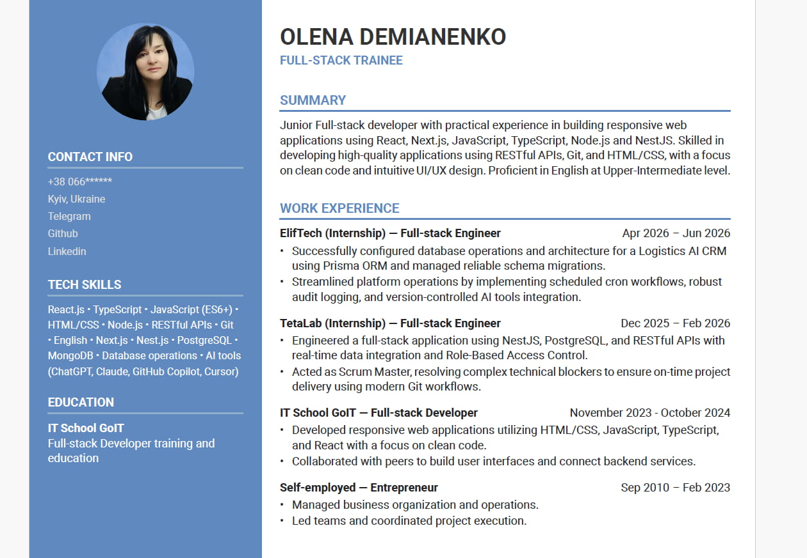

  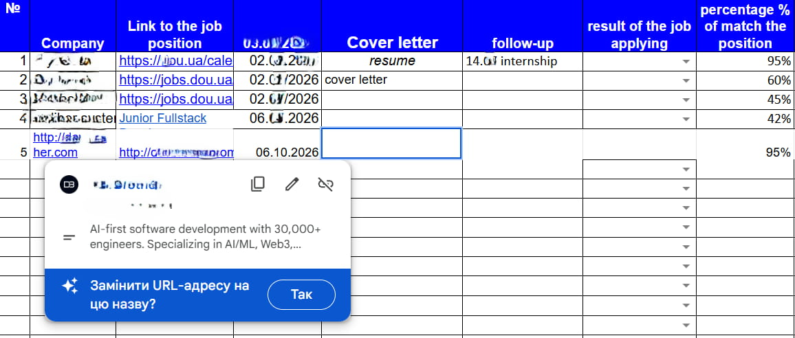
  
 
  <div>

  ---

## 🛠 Tech Stack

**Core Application:**

*   **Framework:** NestJS (Express-based)
*   **Programming Language:** TypeScript
*   **Validation & Typing:** Zod
*   

**Artificial Intelligence & Integrations:**

*   **Orchestration:** LangChain (`@langchain/core`, `langgraph`)
*   **LLM Providers:** OpenAI, Google GenAI
*   **AI Web Search:** Tavily API (`@tavily/core`)
*   **Data Parsing:** `pdf-parse` (text extraction from PDF files)

**Code Quality & Testing:**

*   **Testing:** Jest (Unit tests), Supertest (e2e tests)
*   **Formatting:** ESLint, Prettier

---

##  Installation & Running

**1. Clone the repository and install dependencies:**
```bash
# Install packages
npm install
# Development mode
npm run start

# Watch mode
npm run start:dev

# Production build
npm run start:prod
```

```bash
# Generate a new module
npx nest g module <module-name>

# Generate a new controller
npx nest g controller <controller-name>

# Generate a new service
npx nest g service <service-name>
```

```bash
# Run unit tests
npm run test

# Run end-to-end (e2e) tests
npm run test:e2e

# Check test coverage
npm run test:cov
```

```bash
# Server
PORT=3000

# AI Providers
OPENAI_API_KEY=sk-your-openai-api-key
GOOGLE_API_KEY=your-google-genai-api-key

# AI Tools
TAVILY_API_KEY=tvly-your-tavily-api-key
```